# Page widget: Custom

The **Custom** widget allows a user to insert almost
anything in their document.  To create a custom widget currently
requires knowledge of web development, and access to a public web
server (for example, GitHub Pages).

A good use for custom widgets is to view records or tables in new ways.
Using Grist as your data model and modern HTML/CSS/JS as your view is
very powerful.

## Minimal example

To demonstrate to a web developer how custom widgets work,
there is a minimal working example at:

> <https://public.getgrist.com/911KcgKA95oQ/Minimal-Custom-Widget/m/fork>

The example shows a table with some random data (names for pets), and
two custom widgets, one showing the selected row in the table as JSON,
and the other showing all rows of the table as JSON.  If you change
data in the table, or move the cursor, the custom widgets update as
appropriate.


The source code for the widgets is at:

> <https://github.com/gristlabs/grist-widget/tree/master/inspect>

It is stripped down to the essentials.  Here is the full source code of the
`onRecord` widget that shows one row of data:


```html
<!DOCTYPE html>
<html lang="en">
  <head>
    <meta charset="utf-8">
    <title>onRecord</title>
    <script src="https://docs.getgrist.com/grist-plugin-api.js"></script>
  </head>
  <body>
    <pre id="readout">Waiting for data...</pre>
    <script>
      grist.ready();
      grist.onRecord(function(record) {
        document.getElementById('readout').innerHTML = JSON.stringify(record, null, 2);
      });
    </script>
  </body>
</html>
```

The "Grist" parts of this are:

 * Including `https://docs.getgrist.com/grist-plugin-api.js` to get the Grist API.
 * Calling `grist.ready` to let Grist know the widget is ready to go.
 * Calling `grist.onRecord` to subscribe to the current row of the table.

After that, everything else is regular HTML/CSS/JS.
Once you have data coming in, you can render it any way you like, using React,
Vue.js, or your favorite framework.  For example, you could render
records as a [printable invoice](examples/2020-08-invoices.md), or use some
obscure chart format that Grist doesn't currently support.

## Adding a custom widget

To add a custom widget that reads from a table, click on `Add New`,
then `Add Widget to Page`. Then:

  * For `Select Widget` choose `Custom` to get a Custom Widget.
  * For `Select Data` choose the table you want the widget to read data from.
  * Optionally, choose `Select By` to control the selected data further (read [Linking Page Widgets](linking-widgets.md) 
  for the possibilities).


The custom widget is initially blank.  To configure it, click the three-dots button
on the top right of the custom widget, and select "Widget options".


In the `CUSTOM` settings section where it says `Enter Custom URL`, put
the link to your custom widget.  Here is a test widget to simply show table data
in JSON:

> <https://gristlabs.github.io/grist-widget/inspect/onRecords.html>

And here's one to show the selected row only (make sure "Select By" is set
for the custom widget):

> <https://gristlabs.github.io/grist-widget/inspect/onRecord.html>

## Access level

When you put a link to a custom webpage it will be immediately rendered inside the section.
Now you have the option to grant that webpage access to data in your document.  The
following access levels are available:

   - *No document access*: the webpage is shown in the widget, but it has no access to
     the Grist document containing the widget.
   - *Read selected table*: the webpage is shown in the widget, and is given read access
     to the table the widget is configured to select data from.
   - *Full document access*: the webpage is shown in the widget, and has full access to
     read and modify the Grist document containing the widget.

The webpage should be owned and controlled by you or someone you
trust.  With `Read selected table` permissions, a widget could send the
data it accesses to a third party.  With `Full document access` permissions, a widget could
send all the document data to a third party, and modify your document in
any way.

If you are writing your own custom widget you can specify what access level it needs as
part of the initial **ready** message. Possible values are: `none`, `read table` and
`full`.

```html
<script>
  grist.ready({
    requiredAccess: 'read table'
  });
</script>
```

This directs Grist to request the desired access level from the user. Your widget will be
reloaded with the appropriate access level if the user approves the request.

<span class="screenshot-large">**</span>
{: .screenshot-half }

If you wish to get notified of the access level, you can subscribe to the `onOptions`
event that is sent to the widget after it tells Grist it is ready:

```javascript
grist.onOptions(function(options, interaction) {
  console.log(interaction.access_level);
});
```

For now, just skip the `options` parameter (it will be described in
[Widget options](widget-custom.md#widget-options) section). The current access level is part of
the second parameter, which describes how Grist will interact with your widget.

## Invoice example

The minimal example above showed records as plain JSON, but the widget
can get as fancy as you like.  Here is an example of showing a record
as a printable invoice:


You can read the details of how to use
this widget in our [Invoice preparation example](examples/2020-08-invoices.md).
The invoice widget is hosted at:

> <https://gristlabs.github.io/grist-widget/invoices/>

And the source HTML/CSS/JS can be browsed at:

> <https://github.com/gristlabs/grist-widget/tree/master/invoices>

It uses Vue.js and `grist.onRecord`.

## Creating a custom widget

As you saw, writing a simple widget that uses data from a table is very easy. First, you
need to tell Grist that you are ready and then subscribe to one of the available events:
`onRecord`, `onRecords` or `onOptions`.

```javascript
grist.ready();
grist.onRecord(function (record) {
  // Cursor has moved.
});
grist.onRecords(function (record) {
  // Data in the table has changed.
});
grist.onOptions(function (options, interaction) {
  // Configuration has changed.
});
```

Let's say you want to build a custom widget that will show an image from a URL and
optionally a single line of text below as the image title. You will need to
read two values from two columns: `Link` and `Title`.

You could access those columns directly using literal column names in your
script. Here is a complete example of widget source code that will do the job:

```html
<script src="https://docs.getgrist.com/grist-plugin-api.js"></script>

<div id="title"></div>
<script>
  grist.ready({requiredAccess: 'read table'});
  grist.onRecord(function (record) {
    document.getElementById('image').src = record.Link;
    document.getElementById('title').innerText = record.Title;
  });
</script>
```

When getting started, this is a good approach, but it has two significant drawbacks. Every
time you rename a column, you will also have to change your widget's source. Moreover,
using this widget on a different table or sharing it with your friends can be difficult as
column names might be different. To help with this, Grist offers the column mapping API.

## Column mapping

Instead of using column names directly, you can ask the user to pick which column to use
as a `Link` and `Title`. The list of expected columns can be sent to Grist as part of the
ready call:

```js
grist.ready({columns: ['Link', 'Title']});
```

Using this information, in the creator panel, Grist will hide the regular "Visible"
columns section and display specialized column pickers.

<span class="screenshot-large">**</span>
{: .screenshot-half }

Your widget will receive this mapping configuration as part of `onRecord` or `onRecords`
event in the second parameter. You can use this configuration to do the mappings yourself
or use the `mapColumnNames` helper function to do it for you.

```html
<script src="https://docs.getgrist.com/grist-plugin-api.js"></script>

<div id="title"></div>
<script>
grist.ready({columns: ['Link', 'Title'], requiredAccess: 'read table'});
grist.onRecord(function (record, mappings) {
  const mapped = grist.mapColumnNames(record);
  // First check if all columns were mapped.
  if (mapped) {
    document.getElementById('image').src = mapped.Link;
    document.getElementById('title').innerText = mapped.Title;
    console.log(`Using ${mappings.Link} and ${mappings.Title} columns`);
  } else {
    // Helper returned a null value. It means that not all
    // required columns were mapped.
    console.error("Please map all columns");
  }
});
</script>
```

Now, if you rename one of the columns, the widget will still work. You can also use this
widget in any other table or share with a friend, as it doesn't depend on your table
structure and can be easily configured.

In the configuration used above, we told Grist that all the columns are required, and the
user can pick any column even if the column doesn't contain a text value. To be more
precise, we can include more options in the request. For example:

```javascript
grist.ready({columns: [
  {
    name: "Link", // What field we will read.
    title: "Image link", // Friendly field name.
    optional: false, // Is this an optional field.
    type: "Text" // What type of column we expect.
    description: "Some text" // Description of a field.
    allowMultiple: false // Allows multiple column assignment.
  }
]});
```

The `optional` setting is important for correct operation of the `mapColumnNames` helper.
This helper will return a mapped record only when all required (not optional) columns are
picked.

By default Grist will allow the user to pick any type of column. To allow only a column of
a specific type, you need to set a `type` property. Here are all valid types:

`Int` (*Integer column*), `Numeric` (*Numeric column*), `Text`, `Date`, `DateTime`,
`Bool` (*Toggle column*), `Choice`, `ChoiceList`, `Ref` (*Reference column*), `RefList`
(*Reference List*), `Attachments`.

The default value of `type` is `Any`, so Grist will allow the user to pick any column type. You
can also specify a list of types, for example `Date,DateTime`. In that case, Grist will allow
the user to pick any column that matches one of the types in the list.

Use `title` and `description` fields to help your users understand what is the purpose of
the column. The `description` will be displayed just below the column name, and the
`title` will be used as a column label. Both are optional and you can put there any text
you want.

If you need to map multiple columns (for example in a custom chart widget), you can use
`allowMultiple` option. This will allow your users to pick a set of columns that will
be returned as list of mapped table column names. The `mapColumnNames` helper will then
return an array of mapped column values in a single field.

Suppose the user deletes a column or changes its type so that it will no longer match the
type requested by the widget. In that case, Grist will automatically remove this column
from the mapping.

## Widget options

If your widget needs to store some options, Grist offers a simple key-value storage API
for you to use. Here are some JavaScript code snippets that show how to interact with
this API:

```js
// Store a simple text value .
await grist.setOption('color', '#FF0000');

// Store complex objects as JSON.
await grist.setOption('settings', {lines: 10, skipFirst: true});

// Read previously saved option
const color = await grist.getOption('color');

// Clear all options.
await grist.clearOptions();

// Get and replace all options.
await grist.getOptions();
await grist.setOptions({...});
```

You can experiment with this yourself. Here is a test widget that demonstrates how to use
this API:

> <https://gristlabs.github.io/grist-widget/inspect/onOptions.html>

When your widget saves or edits some options, the icon on top of the section gets
highlighted in green. You can either apply those options to the widget or revert that
modification.

<span class="screenshot-large">**</span>
{: .screenshot-half }

This allows viewers (users with read-only access) or collaborators to
configure your widget without overwriting original settings. This behavior should look
familiar to you and others, as this works like
[sorting and filtering](search-sort-filter.md#saving-sort-settings) on table or card
views.

Saving current options you will apply them to the widget and make them available to
others. Using this menu, you can also clear all options to revert the widget to its
initial state. To do this, press the little trash icon and then `Save`.

Grist will also trigger an event, every time the options are changed (or cleared). Here is
how you can subscribe to this event.

```javascript
grist.onOptions(function(options, interaction) {
  if (options) {
    console.log('Current color', options.color);
  } else {
    // No widget options were saved, fallback to default ones.
  }
});
```

If you are building your own widget, you generally should not read options directly (using
`grist.widgetApi.getOption()`). A better pattern is to apply them all when they are
changed. Using the `onOptions` handler will make your widget easier to change and
understand later.

There is one more scenario to cover. Suppose your widget has some kind of custom
configuration screen. In that case, you probably need some button or other UI element that
the user can use to show it. This additional UI element will likely be rarely used by you
or your collaborators, so it doesn't make sense to show it all the time. To help with
this, Grist offers an additional interaction option you can send as part of the ready
message:

```javascript
grist.ready({
  onEditOptions: function() {
    // Your custom logic to open the custom configuration screen.
  }
});
```

This will tell Grist to display an additional button `Open configuration` in the creator
panel and the section menu. When clicked, it will trigger your handler, which you can use
to show your own custom configuration screen.

<span class="screenshot-large">**</span>
{: .screenshot-half }


## Custom Widget linking

Custom widgets can also be used as a source of linking (see [Linking widgets](linking-widgets.md)).
All you need to do is inform Grist that your widget supports linking by passing an additional
option to the `ready` call (see [Widget API](./code/modules/grist_plugin_api.md#ready)):

```javascript
grist.ready({
  allowSelectBy: true
});
```

This will enable the `Select By` option in the widget configuration panel. Now you can use your
widget to control the cursor position in linked widgets. To do this, you need to call the
`setCursorPos` function:

```javascript
// Inform Grist that the cursor should be moved to the row with id 20.
grist.setCursorPos({rowId: 20});

// or inform that your widget is creating a new row.
grist.setCursorPos({rowId: 'new'});
```


## Premade Custom Widgets

Add a custom widget to your Grist document by adding a new widget to the page and selecting 'Custom' as your widget.

<span class="screenshot-large">*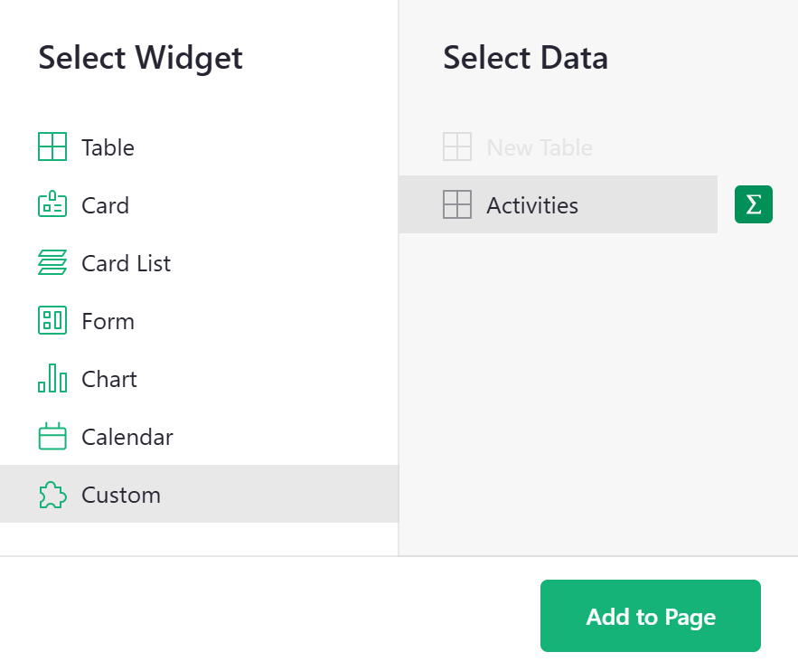*</span>
{: .screenshot-half }

After clicking the green 'Add to Page' button, you will be prompted to select from a list of premade widgets. 

<span class="screenshot-large">*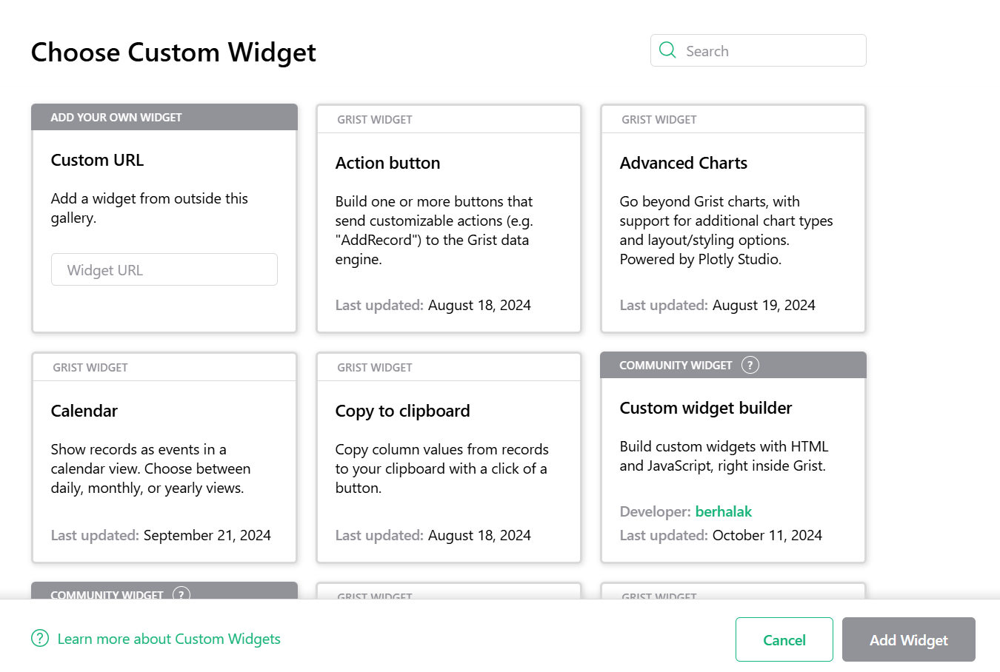*</span>

You also have the option to add your own widget using the Custom URL selection.

<span class="screenshot-large">*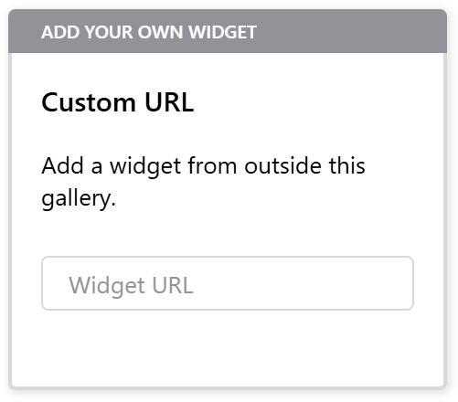*</span>
{: .screenshot-half }

Do you have a great custom widget? Show it off in our *#showcase* category in our [Community Forum](https://community.getgrist.com/c/showcase/8)!

### Advanced Charts

The Advanced Charts custom widget gives you more power and flexibility than Grist’s built-in charts, offering a wide variety of chart types as well as increased control over styling and layout. It’s a version of Plotly’s [Chart Studio](https://chart-studio.plotly.com/), see their [tutorials](https://plotly.com/chart-studio-help/tutorials/) for more detailed help.

You’ll need to set the access level to “Full document access”. Don’t worry, the widget only reads data from the selected table, doesn’t send it to any servers, and doesn’t write or otherwise make changes back to your document.

This is what you should see:

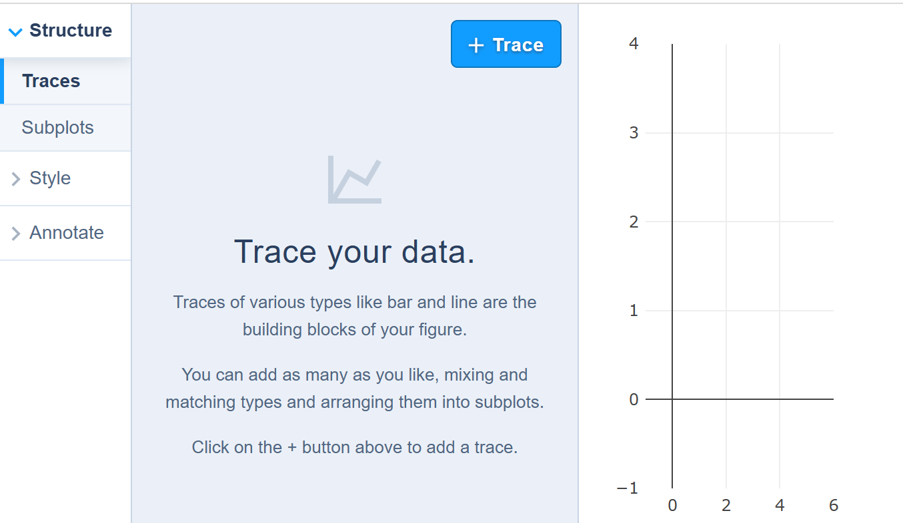

Click the big blue “+ Trace” button to get started. This will add a panel like the following:

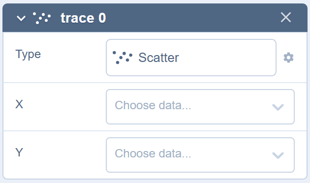

Click “Scatter” to choose a different chart type such as Bar or Line. Then click the “Choose data” dropdowns to select the columns you want to plot.

You can add multiple traces to overlay different plots. Try different panels from the sidebar to customize the chart further. For example, go to Style > Axes > Titles to add a label to each axis. See the [chart studio tutorials](https://plotly.com/chart-studio-help/tutorials/) to learn more.

As you customize the widget, remember to regularly click the ‘Save’ button above the widget to keep your configuration.

### Copy to clipboard

Copy to clipboard copies a value from the specified column of the selected record. When configuring the widget, you will need to select which column you wish to copy data from.

**

Note that you can also copy data from a selected cell by using the keyboard shortcut <code class="keys">*Ctrl* + *C*</code> on Windows or <code class="keys">*⌘* + *C*</code> on Mac. To paste, use <code class="keys">*Ctrl* + *V*</code> or <code class="keys">*⌘* + *V*</code>.

You can find an example of the copy to clipboard button in our [Webinar 7 (Custom Widgets)](https://public.getgrist.com/uGS3WH3mhoVy/7-Webinar-7-Custom-Widgets-End-Result/p/4){:target="\_blank"} template. You can also watch a video walkthrough from our [Custom Widgets Webinar](https://www.youtube.com/watch?v=zNLHX_ezY50&t=2063s){:target="\_blank"}.

### Dropbox Embedder

View and access files saved to dropbox.

<span class="screenshot-large">*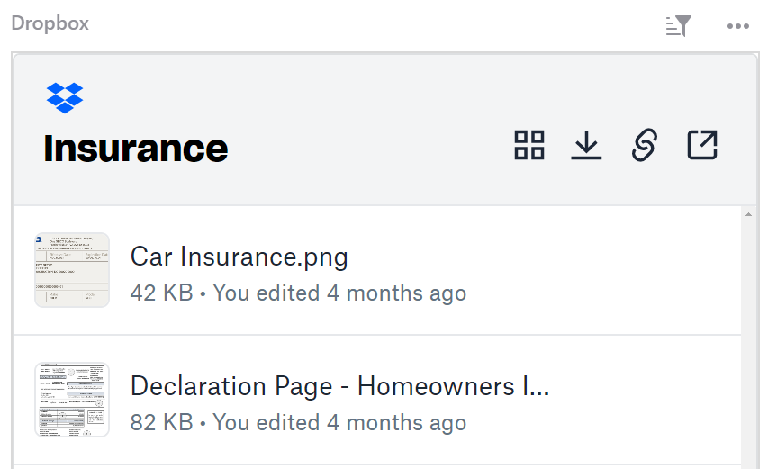*</span>
{: .screenshot-half }

To start, add a new column to your table to store your dropbox links.

Then, add a new custom widget to the page. Choose the data table that contains the dropbox links and 'Select By' that same table.

<span class="screenshot-large">**</span>
{: .screenshot-half }

To configure, select 'Dropbox Embedder' from the Custom dropdown and allow access to read the selected table. Under 'Dropbox Link', select the column that contains your dropbox links.

<span class="screenshot-large">*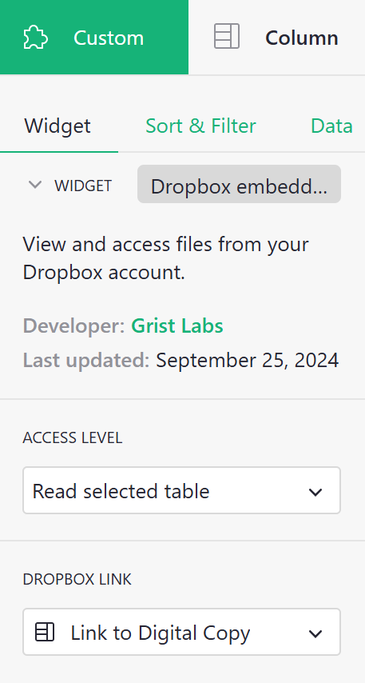*</span>
{: .screenshot-half }

You can create links to folders or specific files in Dropbox. Click 'Share' then set permissions for the link. You can choose to allow anyone with the link to view or edit. Create, then copy the link. Paste this link into your Dropbox Link column in Grist. Note that users cannot edit directly in the custom widget even if edit permissions are granted. To edit, select the object in the Dropbox Embedder and it will open in a new tab where it can be edited directly in Dropbox.

<span class="screenshot-large">*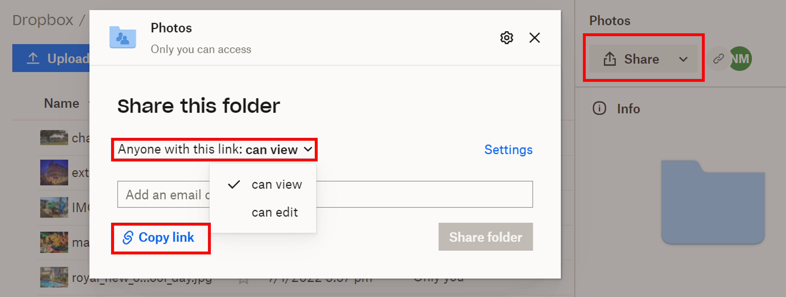*</span>

You can check out an example of the Dropbox Embedder in our [Hurricane Preparedness](https://templates.getgrist.com/uXMbETLdfriM/Hurricane-Preparedness){:target="\_blank"} template.

**

### Grist Video Player

Embed videos from online sources like YouTube, Vimeo, Facebook Video, Google Drive and more.

**

To start, add a new column to your table to store your video URLs.

Then, add a new custom widget to the page. Choose the data table that contains the video URLs and 'Select By' that same table.

<span class="screenshot-large">**</span>
{: .screenshot-half }

To configure, select 'Grist Video Player' from the Custom dropdown and allow access to read the selected table. Under 'URL', select the column that contains your video URLs.

<span class="screenshot-large">*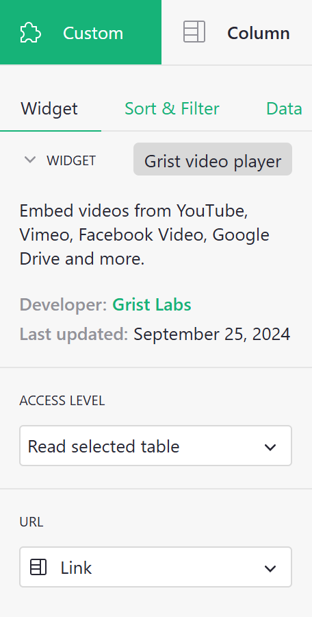*</span>
{: .screenshot-half }

For most online videos, including YouTube videos and videos stored on Google Drive, you can simply click the 'Share' option and copy the URL.

**

For some other videos, you may see this error:

**

If this happens, you'll need to take the URL from the Embed code.

After clicking the share option on the video, click the option to 'Embed'.

**

Then, click to copy the code.

**

The code it gives you will look something like this:

**

Copy the URL that is found between quotes following `src`. The highlighted portion in the screenshot below is what you would copy for this particular Facebook video.

**

Paste this URL into your URL column in Grist and the video will now appear in the Grist Video Player custom widget.

**

### HTML Viewer

The HTML viewer displays HTML written in a cell.

For text-editing widgets, check out our [Markdown](#markdown) and [Notepad](#notepad) custom widgets.

**

To start, add a new column to your table. This will be where you add you write HTML.

Then, add a new custom widget to the page. Choose the data table that contains the HTML and 'Select By' that same table.

<span class="screenshot-large">**</span>
{: .screenshot-half }

To configure, select 'HTML Viewer' from the Custom dropdown and allow access to read the selected table. Under 'HTML', select the text column that contains your HTML.

<span class="screenshot-large">*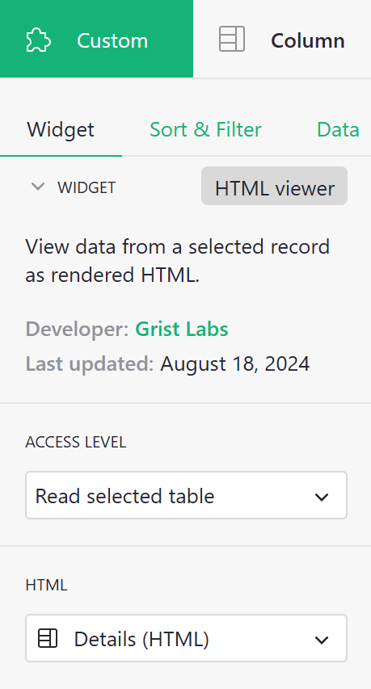*</span>
{: .screenshot-half }

Your HTML will be viewable in the custom widget.

**

For help on HTML formatting, check out this guide from W3 Schools: [HTML Text Formatting](https://www.w3schools.com/html/html_formatting.asp){:target="\_blank"}

You can find an example of the HTML Viewer in our [Webinar 7 (Custom Widgets)](https://public.getgrist.com/uGS3WH3mhoVy/7-Webinar-7-Custom-Widgets-End-Result/p/1){:target="\_blank"} template. You can also watch a video walkthrough from our [Custom Widgets Webinar](https://www.youtube.com/watch?v=zNLHX_ezY50&t=1538s){:target="\_blank"}.

### Image Viewer

View images from URL.

**

To start, add a new column to your table. This will be where you add the URL for your image.

Then, add a new custom widget to the page. Choose the data table that contains the image URL and 'Select By' that same table.

<span class="screenshot-large">**</span>
{: .screenshot-half }

To configure, select 'Image Viewer' from the Custom dropdown and allow access to read the selected table. Under 'Image URL', select the column that contains the URLs for your images.

<span class="screenshot-large">*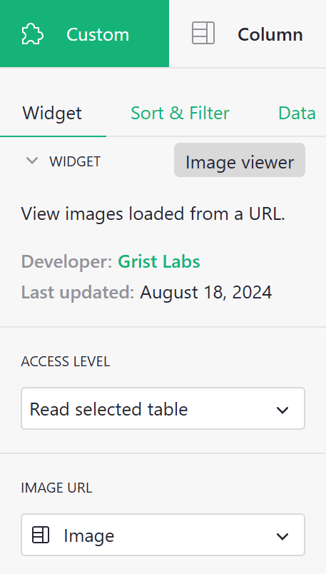*</span>
{: .screenshot-half }

To copy the URL for an image, right click on the photo then 'Copy image address'. This copies the URL to your clipboard. Paste this URL into your specified column in Grist.

**

Additionally, you can add multiple images for a specific record by adding multiple image URLs, separated by a space or new line, into a single cell.

Please note that a comma will not work to separate the links. 

**

When multiple image URLs are present, the image viewer custom widget will function as a carousel. Click the arrows to view additional images.

<span class="screenshot-large">*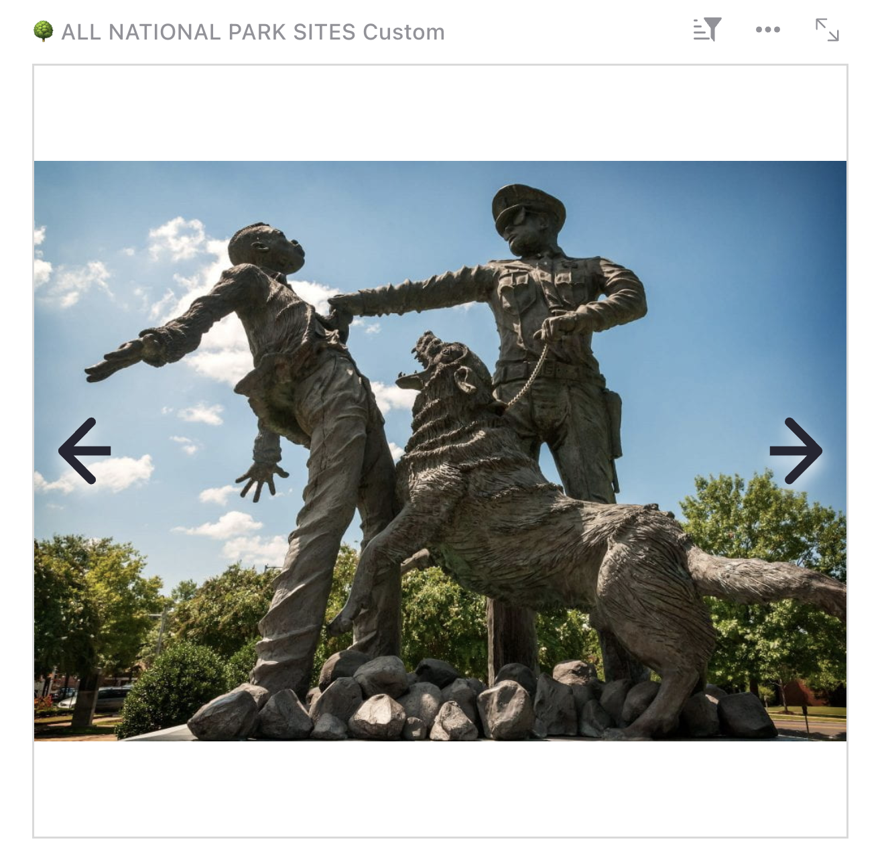*</span>
{: .screenshot-half }

For an example of the Image Viewer widget, check out our [U.S. National Park Database](https://templates.getgrist.com/4TRbjZXSPtR5/US-National-Park-Database/p/4){:target="\_blank"}, and add a park review while you're there!

You can also check out our [Meme Generator](https://templates.getgrist.com/gtzQwTXkgzFG/Meme-Generator){:target="\_blank"} template for another great example.

For a video walkthrough, be sure to watch our [Custom Widgets Webinar](https://www.youtube.com/watch?v=zNLHX_ezY50&t=559s){:target="\_blank"}!

### JupyterLite Notebook

This widget lets you run custom Python code in [JupyterLite](https://jupyterlite.readthedocs.io/), a version of [JupyterLab](https://jupyterlab.readthedocs.io/en/stable/index.html) running entirely in the browser. You can use the full [custom widget plugin API](./code/modules/grist_plugin_api.md) and access or modify any data in the document (subject to Access Rules), unlocking nearly unlimited possibilities for advanced users.

You’ll be presented with a notebook where you can enter and run Python code, e.g:


After typing code in a cell, click the play button or press Shift+Enter to run that cell.

Unlike formulas, code isn’t saved automatically. You must press the usual ‘Save’ button above the widget (outside the notebook) to persist the code within your Grist document. On the other hand, changes to settings within the notebook (e.g. keyboard shortcuts) are saved in your browser’s local storage, so they’re not shared with other users of the document.

A special object called `grist` is automatically available to use in Python code, which mirrors many common methods of the usual [JS plugin API](./code/modules/grist_plugin_api.md). Note that many of these methods are asynchronous, so you should use `await` before calling them.

- `async fetch_selected_table()`: returns the data of the table backing the notebook widget.
- `async fetch_selected_record(row_id=None)`: returns a record of the table backing the notebook widget. If `row_id` is specified, returns the record at that row. Otherwise, returns the record at the current cursor position in a widget linked to the notebook widget.
- `async fetch_table(table_id)`: returns the data of the specified table. Note that this differs from `fetch_selected_table` (even for the same table) in several ways:
    - The widget must have full document access.
    - All columns are included, whereas `fetch_selected_table` excludes columns that are hidden in the widget configuration.
    - All rows are included, whereas `fetch_selected_table` takes widget filters and 'SELECT BY' into account.
    - The data is not sorted according to the widget's configuration.
    - The data is fetched from the server, so the method may be slower.
    - The values for reference columns are row IDs of the referenced table, whereas `fetch_selected_table` returns the values displayed based on the 'SHOW COLUMN' configuration.
- `on_record(callback)`: registers a callback function to run when the cursor moves in a widget linked to the notebook widget, i.e. the widget chosen from the "SELECT BY" dropdown in the Data section of the widget configuration. The callback function will be passed the record at the current cursor position. You can also use this as a decorator, i.e. `@grist.on_record`.
- `on_records(callback)`: similar to `on_record`, but runs when the source data of the widget changes. The callback function will be passed the same data as returned by `fetch_selected_table`.
- `get_table(table_id)`: returns a `TableOperations` class similar to the interface in the usual [JS plugin API](./code/interfaces/TableOperations.TableOperations.md) for performing CRUD-style operations on a table. See the plugin API documentation for details on the parameters. The class has the following methods:
    - `async create(records, parse_strings=True)`
    - `async update(records, parse_strings=True)`
    - `async upsert(records, parse_strings=True, add=True, update=True, on_many="first", allow_empty_require=False)`
    - `async destroy(row_ids)`

You can also use `grist.raw` for direct access to the plugin API, e.g. `await grist.raw.docApi.fetchTable(table_id)`. This may return raw cell values which you can decode with `grist.decode_cell_value(value)`.

You can use many (but not all) third-party libraries in your notebook such as `pandas`. Many will be installed automatically when they're imported. Others will require running `%pip install <package name>` in a cell, e.g. `%pip install pandas`. Note that it's `%pip` and not `!pip` as in a regular Jupyter notebook.

### Map

The custom map widget allows you to display locations using latitude and longitude coordinates. If your data is an address, rather than in lat-long format, Grist can convert the address into lat-long coordinates.

*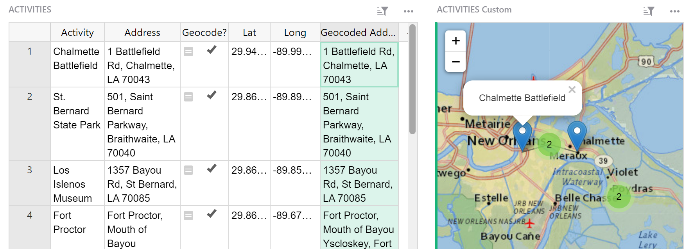*

If using existing lat-long coordinates, you will need three columns; Name, Longitude and Latitude.

<span class="screenshot-large">**</span>
{: .screenshot-half }

If using an address, you will need six columns; Name, Address, Geocode, Longitude, Latitude, and Geocoded Address.

**

Geocode is a [toggle type column](col-types.md#toggle-columns) that should be set to true for any record you wish to convert from address to lat-long coordinates to be shown on the map.

If you wish to convert all records, you can make Geocode a formula column with the formula = `True`. This will mark all records as True.

<span class="screenshot-large">**</span>
{: .screenshot-half }

Next, add a new custom widget to the page. Choose the data table that contains the addresses or lat-long coordinates and 'Select By' that same table.

<span class="screenshot-large">**</span>
{: .screenshot-half }

To configure, select 'Map' from the Custom dropdown.

If you already have **lat-long coordinates**, you can set your access level to *Read selected table*.

If you are using an **address** and that needs to be converted into lat-long coordinates, you will need to set your access level to *Full document access* because the widget needs permission to write to your document in order to add lat-long coordinates.

<span class="screenshot-large">**</span>
{: .screenshot-half }

Map all required columns. Note that Name, Longitude and Latitude are labeled as required. Geocode, Address and Geocoded Address are listed as optional. If you are using addresses and need Grist to convert these to lat-long coordinates, you must map all six columns.

<span class="screenshot-large">**</span>
{: .screenshot-half }

After mapping the necessary columns and selecting the appropriate Access Level, the map widget will populate.

*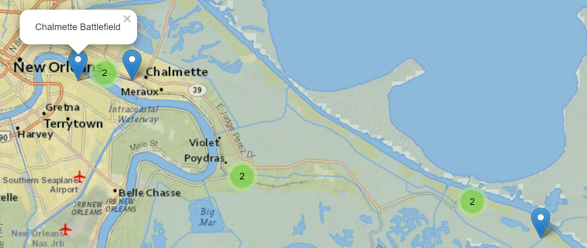*

You can configure the map to show only the selected location by clicking the 'Open Configuration' option in the [creator panel](glossary.md#creator-panel). Then, uncheck 'All Locations'. Click the green check mark at the top of the widget to save the updated configuration settings.

**

Check out our [Mapping Locations](https://templates.getgrist.com/pyMHqncEspfZ/Mapping-Locations){:target="\_blank"} template or our [Crowdsourced List](https://templates.getgrist.com/dKztiPYamcCp/Crowdsourced-List/p/1){:target="\_blank"} for two great examples!

For a video walkthrough, check out our [Custom Widgets Webinar](https://www.youtube.com/watch?v=zNLHX_ezY50&t=713s){:target="\_blank"}.

### Markdown

The Markdown custom widget allows you to format text using Markdown while displaying the formatted text in an editable widget.

For other text-editing widgets, check out our [HTML](#html-viewer) and [Notepad](#notepad) custom widgets.

**

To start, add a new column to your table. This will be where you will add your text that will be formatted using Markdown.

Then, add a new custom widget to the page. Choose the data table that contains the text formatted with Markdown and 'Select By' that same table.

<span class="screenshot-large">**</span>
{: .screenshot-half }

To configure, select 'Markdown' from the Custom dropdown and allow **Full document access**. Because the widget is also an editor, it needs permission to write to the document.

Under 'Content', select the text column that contains Markdown formatting.

<span class="screenshot-large">**</span>
{: .screenshot-half }

Any Markdown formatting in the specified text column will apply and be viewable and editable in the custom widget.

*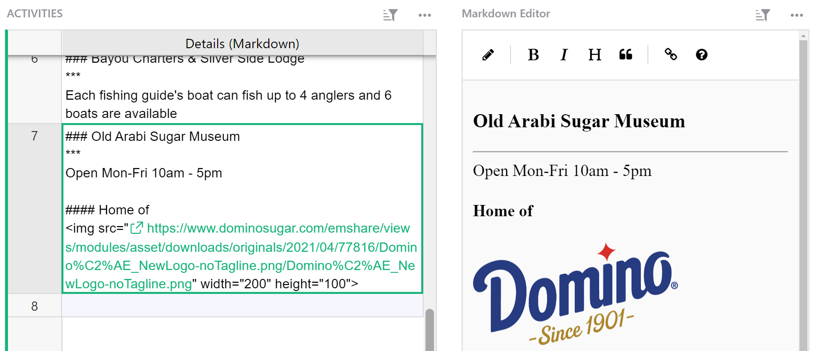*

To edit the text directly in the widget, click the edit icon. The text will revert to display Markdown syntax that can be edited directly in the widget. When in edit mode, the edit icon will be replaced with the save icon. Be sure to click the save icon to save any changes and return to viewing the formatted text.

<span class="screenshot-large">**</span>
{: .screenshot-half }

For help on Markdown formatting, check out the [Markdown Guide](https://www.markdownguide.org/basic-syntax/){:target="\_blank"} for basic syntax. This guide is also accessible in the Markdown widget by clicking the information icon at the top of the widget. The guide will open in a new tab of your browser for easy reference.

You can find an example of the Markdown editor in our [Webinar 7 (Custom Widgets)](https://public.getgrist.com/uGS3WH3mhoVy/7-Webinar-7-Custom-Widgets-End-Result){:target="\_blank"} template and check out this video walkthrough from our [Custom Widgets Webinar](https://www.youtube.com/watch?v=zNLHX_ezY50&t=1339s){:target="\_blank"}.

### Notepad

The Notepad custom widget allows you to format text using a rich text editor.

For other text-editing widgets, check out our [HTML](#html-viewer) and [Markdown](#markdown) custom widgets.

*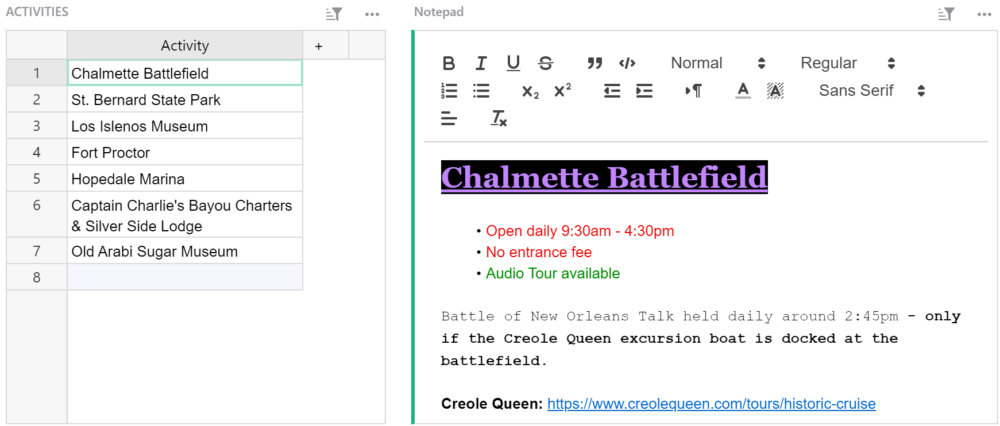*

To start, add a new column to your table. This will be where details for our formatted text will be stored.

Then, add a new custom widget to the page. Choose the data table that contains the column we just added and 'Select By' that same table.

<span class="screenshot-large">**</span>
{: .screenshot-half }

To configure, select 'Notepad' from the Custom dropdown and allow **Full document access**. Because the widget is also an editor, it needs permission to write to the document.

Under 'Content', select the column created to store our formatted text.

<span class="screenshot-large">*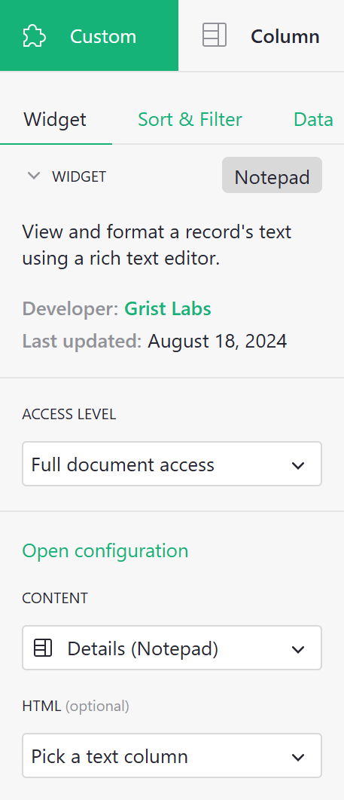*</span>
{: .screenshot-half }

If the text column you chose under Content has existing text, that text will appear in the Notepad widget, ready to be formatted.

**

Use any of the options shown here to format your text.

**

As you can see in the screenshot below, the code for the formatted text is not useful to see in your table. You will edit text directly in the Notepad widget so you can [hide](widget-table.md#column-operations) this column from your data table.

*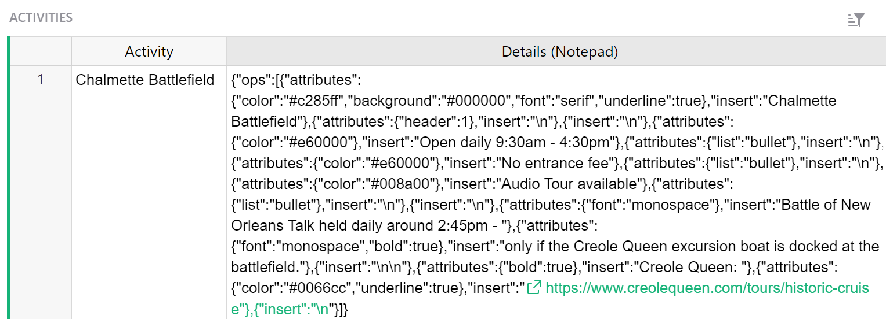*

Check out our [U.S. National Park Database](https://templates.getgrist.com/4TRbjZXSPtR5/US-National-Park-Database/p/13){:target="\_blank"} or our [🛒 Grocery List + Meal Planner](https://templates.getgrist.com/cMQA7uuBbtMW/-Grocery-List-Meal-Planner/p/3){:target="\_blank"} for two great Notepad examples!

You can also check out this video walkthrough from our [Custom Widgets Webinar](https://www.youtube.com/watch?v=zNLHX_ezY50&t=1194s){:target="\_blank"}.

### Print Labels

The Print Labels custom widget allows you to customize and print labels directly from Grist.

**

To start, add a new column to your table. This column will contain the text for the label. Optionally, you can add a second column to specify a label count, allowing you to print more than one of the same label without having to create duplicate records.

Next, add a new custom widget to the page. Choose the data table that contains the label details.

<span class="screenshot-large">**</span>
{: .screenshot-half }

To configure, select 'Print Labels' from the Custom dropdown and allow access to read the selected table. Under 'Label', select the column that contains the text to include on the labels. If you wish to print more than one of any labels, select the column that contains the number of labels for each record you wish to print.

<span class="screenshot-large">*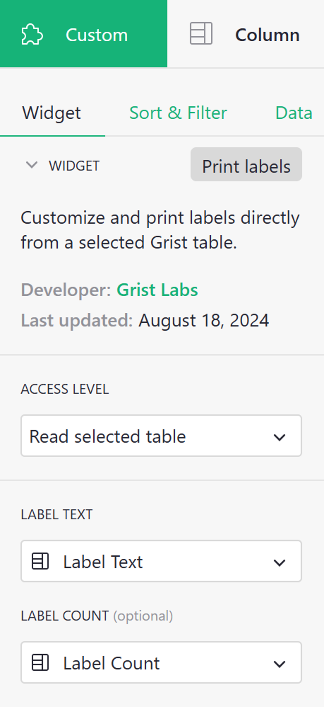*</span>
{: .screenshot-half }

You can select from standard sheet sizes under the dropdown in the upper left of the widget. Be sure to save any changes by clicking the green check mark at the upper right of the widget.

**

To leave any blank labels at the beginning of the sheet, click the settings icon then specify how many labels should be left blank. This is especially helpful if a portion of your label sheet has already been used. You can skip the used labels and begin printing on your first unused label.

**

Check out our [Print Mailing Labels](https://templates.getgrist.com/9nNr9uQwoXWA/Print-Mailing-Labels){:target="\_blank"} template and our [Treasure Hunt](https://templates.getgrist.com/ihsZTnKTF7Lr/Treasure-Hunt/p/6){:target="\_blank"} template for two great examples!

You can also check out this video walkthrough from our [Custom Widgets Webinar](https://www.youtube.com/watch?v=zNLHX_ezY50&t=1749s){:target="\_blank"}.
