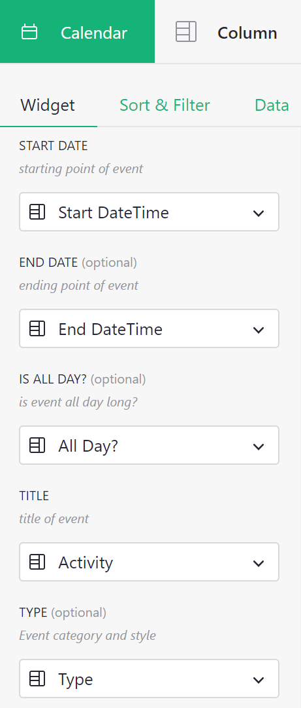
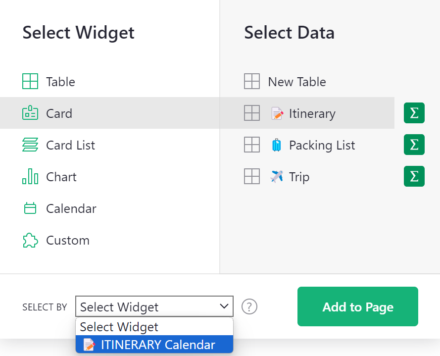
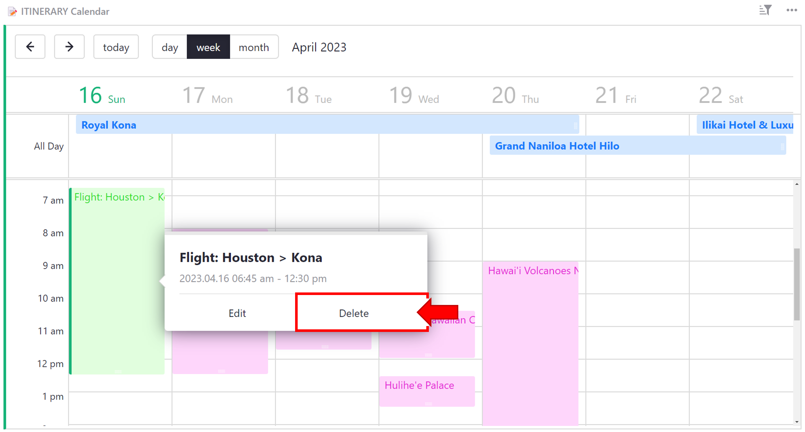

# Page widget: Calendar

The calendar widget allows viewing data in a calendar view. In Grist, event data is stored in a data table. Then, the calendar widget can be configured to display that data.

**

## Setting up your data

In your data table, you will need two columns of data, with the option to add two additional data columns:

1. **Title**: [Text](col-types.md#text-columns) column, containing the title of your event.
2. **Start Date**: [Date](col-types.md#date-columns) or [DateTime](col-types.md#datetime-columns) column, containing the date, or date and time, that the event begins.
3. *(Optional)* **End Date**: [Date](col-types.md#date-columns) or [DateTime](col-types.md#datetime-columns) column, containing the date, or date and time, that the event ends.
4. *(Optional)* **All Day?**: [Toggle](col-types.md#toggle-columns) column, noting if an event is all day long.

**

## Configuring the calendar

Add a calendar widget from the ‘Add New’ menu. Select the table containing your event data.

**
{: .screenshot-half }

Configure the widget by selecting the columns in your data table that contain Start Date, End Date (optional), Title and Is All Day (optional).

**
{: .screenshot-half }

## Adding a new event

You can add a new event by clicking on the start time for the event in the calendar widget. In the popup, you can add a title for the event and modify the start and end time. You also have the option to mark the event as 'all day'. 

**

You can also modify the start and end time of an event by clicking and dragging the event directly on the calendar.

To modify an event’s start time, click and drag from the middle of the event. When modifying start time, the duration of the event will remain the same. 

**

To modify an event's end time, click and drag from the bottom of the event. You’ll notice that the icon is slightly different from the icon that appears when modifying start time. 

**

Any changes to start and end time will be made to the underlying data table so your data will always be consistent!

## Linking event details

It might be useful to see more event details in a table or card widget.

This example will walk through a card widget.

To create a linked view, add a new type of widget such as a table or a card, and select the same data table. Under ‘Select By’, select the calendar widget. Then, add to page.

**
{: .screenshot-half }

Now, when you click on an event in the calendar widget, the linked widget will update to show the details for the selected event.

**

!!! note "Collapsing widgets"
    Drag the linked widget into the attic at the top of the page to collapse. The widget will still be linked but will take up less space on the page! Simply click the box to expand and view linked record details.

    Read more on [Custom Layouts](custom-layouts.md).

## Deleting an event
To delete an event, select the event in the calendar then click 'delete' in the popup.

**
